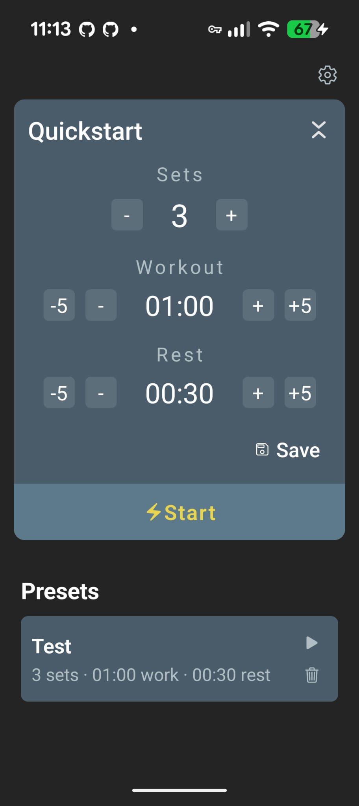
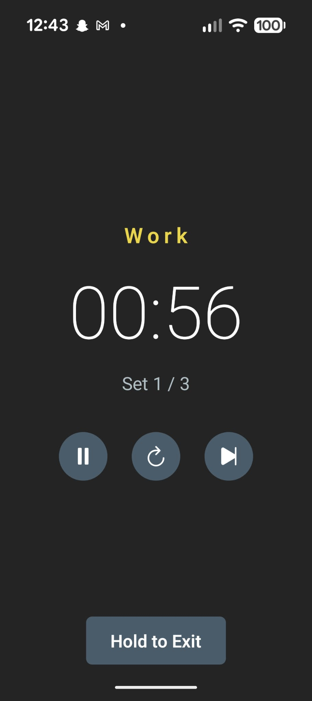

# PopTimer

[](https://github.com/ioluas/popcorn/actions/workflows/ci.yml)
[](https://codecov.io/github/ioluas/popcorn)

A bespoke workout interval timer app built with React Native and Expo for my niece. Popcorn is the name of her pet cockatoo bird.

## Screenshots

<p align="center">
  
  
  
</p>

## Features

- **Customizable intervals**: Set number of sets, work time, and rest time
- **Presets**: Save and load your favorite timer configurations
- **Audio cues**: Beep sounds on phase transitions
- **Haptic feedback**: Vibration feedback for interactions
- **Multi-language support**: English, Swedish, and Arabic (with RTL layout)
- **Dark theme**: Easy on the eyes during workouts

### Tooling

- Node.js 22.14.0+, npm 11.7+, eas-cli 16.28.0+
- [Expo CLI](https://docs.expo.dev/get-started/installation/)

### Installation

```bash
npm ci
```

### Development

```bash
npm start
```

Then press `a` for Android or `i` for iOS.

### Running Tests, Linting, Formatting & type checking

```bash
npm test
npm run lint
npm run format
npm run typecheck
```

## Building

```bash
# production build
eas build --platform android --profile production

# development build
eas build --platform android --profile development
# or using expo go
npm run start
```
